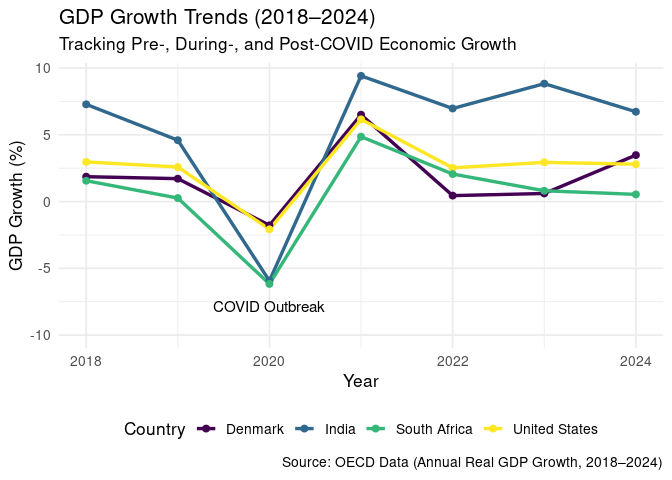
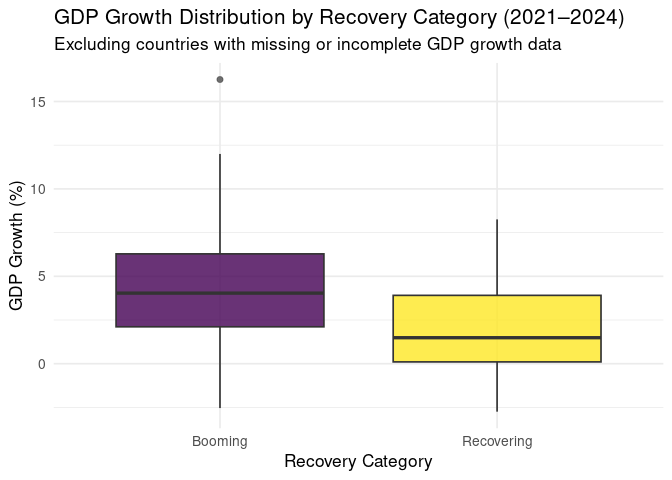
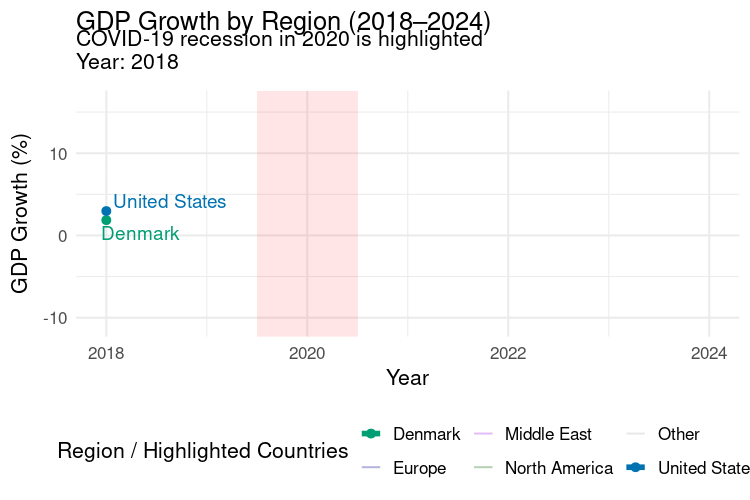

Project memo
================
AJJ

This document should contain a detailed account of the data clean up for
your data and the design choices you are making for your plots. For
instance you will want to document choices you’ve made that were
intentional for your graphic, e.g. color you’ve chosen for the plot.
Think of this document as a code script someone can follow to reproduce
the data cleaning steps and graphics in your handout.

``` r
library(tidyverse)
library(broom)
library(gganimate)
library(scales)
library(readxl)
library(dplyr)
library(ggplot2)
library(ggrepel)
library(gifski)
```

## Data Clean Up Steps for Overall Data

### Step 1: Load and Inspect Dataset

``` r
GDP_Data <- read_excel("/cloud/project/data/Annual_GDP_Growth_OECD_and_non_OECD.xlsx")
# View(Annual_GDP_Growth_OECD_and_non_OECD)

GDP_Per_Capita <- read_excel("/cloud/project/data/Annual GDP Per Capita OECD and Non-OECD.xlsx.xlsx")
# View(Annual_GDP_Per_Capita_OECD_and_Non_OECD_xlsx)
```

### Step 2: Rename Columns and Pivot Longer

``` r
names(GDP_Per_Capita)[1] <- "Country"
```

``` r
# make all column names characters  
names(GDP_Data) <-
  as.character(names(GDP_Data))

# convert all "year" columns (2018–2024) to characters before pivoting
GDP_Data <-
  GDP_Data %>%
  mutate(across(matches("^20"), as.character))

# pivot longer using the original "Time Period" column  
gdp_growth_long <- GDP_Data %>%
  pivot_longer(
    cols = matches("^20"),       # selects 2018–2024 columns
    names_to = "Year",
    values_to = "GDP_Growth"
  ) %>%
  mutate(
    Year = as.integer(Year),     # turn "2018" → 2018
     GDP_Growth = as.numeric(GDP_Growth),
    Country = `Time period`
  ) %>%
  select(-`Time period`)

gdp_growth_long <- gdp_growth_long %>%
  filter(Country != "Country")

GDP_Per_Capita <- GDP_Per_Capita %>%
  filter(str_trim(Country) != "Country") %>%
  select(-2)
```

Description: The dataset originally had years (2018–2024) as columns,
which makes it wide. pivot_longer() converts it into a tidy long format
with Year and GDP_Growth columns, making it easier to plot over time.

### Step 3: Categorize Countries by Post Pandemic Growth

``` r
post_pandemic_growth <- gdp_growth_long %>%
  filter(Year >= 2021) %>%
  group_by(`Country`) %>%
  summarize(avg_growth_post_pandemic = mean(GDP_Growth, na.rm = TRUE)) %>%
  arrange(desc(avg_growth_post_pandemic))
```

Description:

### Step 4: Clean Non-OECD Countries from Filtered Data

``` r
gdp_growth_long <- gdp_growth_long %>%
  mutate(`Country` = str_replace(`Country`, pattern = "·  ", replacement = ""))
```

## Plots

#### Final Plot 1

### Plot 1: GDP Growth Trends Over Time by Country

#### Data cleanup steps specific to plot 1

Already handled above (pivot + filter + mutate).

``` r
# Filter for your four focus countries
focus_countries <- c("United States", "Denmark", "South Africa", "India")

(plot1_gdp_trends <- gdp_growth_long %>%
  filter(`Country` %in% focus_countries) %>%
  ggplot(aes(x = Year, y = GDP_Growth, color = `Country`, group = `Country`)) +
  geom_line(size = 1.2) +
  geom_point(size = 2) +
  labs(
    title = "GDP Growth Trends (2018–2024)",
    subtitle = "Tracking Pre-, During-, and Post-COVID Economic Growth",
    x = "Year",
    y = "GDP Growth (%)",
    color = "Country",
    caption = "Source: OECD Data (Annual Real GDP Growth, 2018–2024)"
  ) +
  theme_minimal(base_size = 13) +
  theme(legend.position = "bottom") + 
  scale_color_viridis_d() +
    ylim(-10, NA) +
    annotate("text", x = 2020, y = -7, label = "COVID Outbreak", color = "black", size = 4, vjust = 1.5))
```

    ## Warning: Using `size` aesthetic for lines was deprecated in ggplot2 3.4.0.
    ## ℹ Please use `linewidth` instead.
    ## This warning is displayed once every 8 hours.
    ## Call `lifecycle::last_lifecycle_warnings()` to see where this warning was
    ## generated.


``` r
ggsave("plot1_gdp_trends.png", plot = plot1_gdp_trends, width = 7, height = 5)
plot1_gdp_trends
```



Description:

### Plot 2: Average GDP Growth by Category

``` r
post_pandemic_growth <- gdp_growth_long %>%
  filter(Year >= 2021) %>%
  group_by(`Country`) %>%
  summarize(avg_growth_post_pandemic = mean(GDP_Growth, na.rm = TRUE)) %>%
  arrange(desc(avg_growth_post_pandemic))

plot2_post_pandemic <- post_pandemic_growth %>%
  slice_max(avg_growth_post_pandemic, n = 15) %>%
  ggplot(aes(x = reorder(`Country`, avg_growth_post_pandemic), y = avg_growth_post_pandemic)) +
  geom_col(fill = "#0072B2") +
  coord_flip() +
  labs(
    title = "Top 15 Countries by GDP Growth (2021–2024)",
    subtitle = "Post-COVID Economic Recovery Strength",
    x = "Country",
    y = "GDP Growth (%)",
  ) +
  theme_minimal(base_size = 13)

ggsave("plot2_post_pandemic.png", plot = plot2_post_pandemic, width = 7, height = 5)
plot2_post_pandemic
```


Description:

### Plot 3: GDP Growth Distribution by Recovery Category (2021-2024)

``` r
# Step 1: Categorize countries based on post-pandemic average growth
gdp_growth_long_cat <- gdp_growth_long %>%
  filter(Year >= 2021) %>%
  group_by(`Country`) %>%
  mutate(
    avg_growth = mean(GDP_Growth, na.rm = TRUE),
    Recovery_Category = case_when(
      avg_growth > 0 & avg_growth <= 3 ~ "Recovering",
      avg_growth > 3 ~ "Booming",
      TRUE ~ NA_character_
    )
  ) %>%
  ungroup()

# Step 2: Remove any rows with NA in Recovery_Category
gdp_growth_long_cat <- gdp_growth_long_cat %>%
  filter(!is.na(Recovery_Category))

# Step 3: Create box plot
plot3_box <- gdp_growth_long_cat %>%
  ggplot(aes(x = Recovery_Category, y = GDP_Growth, fill = Recovery_Category)) +
  geom_boxplot(alpha = 0.8, outlier.color = "gray30") +
  labs(
    title = "GDP Growth Distribution by Recovery Category (2021–2024)",
    subtitle = "Excluding countries with missing or incomplete GDP growth data",
    x = "Recovery Category",
    y = "GDP Growth (%)",
    ) +
  scale_fill_manual(values = c(
    "Recovering" = "#F1C40F",
    "Booming" = "#2ECC71"
  )) +
  theme_minimal(base_size = 13) +
  theme(legend.position = "none") +
  scale_fill_viridis_d()

# Step 4: Save and display plot
ggsave("plot3_box.png", plot = plot3_box, width = 5, height = 4)
plot3_box
```



Description:

### Plot 4: GDP Growth Animation

``` r
# Region classification (simple)
region_map <- tibble(
  Country = unique(GDP_Data$`Time period`),
  Region = case_when(
    Country %in% c("United States", "Canada", "Mexico") ~ "North America",
    Country %in% c("Denmark", "France", "Germany", "United Kingdom", "Italy", "Spain",
                   "Norway","Sweden","Finland","Netherlands","Belgium","Switzerland") ~ "Europe",
    Country %in% c("India") ~ "Asia",
    Country %in% c("Türkiye") ~ "Middle East",
    Country %in% c("South Africa") ~ "Africa",
    TRUE ~ "Other"
  )
)

gdp_region <- GDP_Data %>%
  pivot_longer(
    cols = matches("^20"),
    names_to = "Year",
    values_to = "GDP_Growth"
  ) %>%
  mutate(
    Country = `Time period`,
    Year = as.integer(Year),
    GDP_Growth = as.numeric(GDP_Growth)
  ) %>%
  select(-`Time period`) %>%
  left_join(region_map, by="Country")


focus_countries <- c("United States", "Denmark", "India", "South Africa")
gdp_region <- gdp_region %>%
  mutate(Highlight = ifelse(Country %in% focus_countries, "Focus", "Other"))

focus_colors <- c(
  "United States" = "#0072B2",
  "Denmark"       = "#009E73",
  "India"        = "#D55E00",
  "South Africa"  = "#CC79A7"
)

plot_region_covid <- gdp_region %>%
  ggplot(aes(x = Year, y = GDP_Growth, group = Country)) +

  # COVID shading
  annotate("rect",
           xmin = 2019.5, xmax = 2020.5,
           ymin = -Inf, ymax = Inf,
           fill = "red", alpha = 0.1) +

  # Other countries
  geom_line(
    data = gdp_region %>% filter(Highlight == "Other"),
    aes(color = Region),
    alpha = 0.3,
    linewidth = 0.7
  ) +

  # Highlighted countries
  geom_line(
    data = gdp_region %>% filter(Highlight == "Focus"),
    aes(color = Country),
    linewidth = 2
  ) +

  geom_point(
    data = gdp_region %>% filter(Highlight == "Focus"),
    aes(color = Country),
    size = 2.5
  ) +

  geom_text_repel(
    data = gdp_region %>% filter(Highlight == "Focus"),
    aes(label = Country, color = Country),
    size = 5,
    show.legend = FALSE
  ) +
  
  scale_color_manual(
    values = c(
      "North America"="darkgreen",
      "Europe"="darkblue",
      "Africa"="orange",
      "Middle East"="purple",
      "Asia"="red",
      "Other"="grey70",
      focus_colors
    )
  ) +

  labs(
    title = "GDP Growth by Region (2018–2024)",
    subtitle = "COVID-19 recession in 2020 is highlighted\nYear: {frame_along}",
    x = "Year",
    y = "GDP Growth (%)",
    color = "Region / Highlighted Countries"
  ) +
  theme_minimal(base_size = 16) +
  theme(legend.position = "bottom") +
  transition_reveal(Year)

animate(
  plot_region_covid,
  fps = 9,
  duration = 10,
  width = 750,
  height = 500,
  units = "px",
  renderer = gifski_renderer()
)
```

<!-- -->

``` r
unique(GDP_Data$`Time period`)
```

    ##  [1] "Country"                         "Australia"                      
    ##  [3] "Austria"                         "Belgium"                        
    ##  [5] "Canada"                          "Chile"                          
    ##  [7] "Colombia"                        "Costa Rica"                     
    ##  [9] "Czechia"                         "Denmark"                        
    ## [11] "Estonia"                         "Finland"                        
    ## [13] "France"                          "Germany"                        
    ## [15] "Greece"                          "Hungary"                        
    ## [17] "Iceland"                         "Ireland"                        
    ## [19] "Israel"                          "Italy"                          
    ## [21] "Japan"                           "Korea"                          
    ## [23] "Latvia"                          "Lithuania"                      
    ## [25] "Luxembourg"                      "Mexico"                         
    ## [27] "Netherlands"                     "New Zealand"                    
    ## [29] "Norway"                          "Poland"                         
    ## [31] "Portugal"                        "Slovak Republic"                
    ## [33] "Slovenia"                        "Spain"                          
    ## [35] "Sweden"                          "Switzerland"                    
    ## [37] "Türkiye"                         "United Kingdom"                 
    ## [39] "United States"                   "·  Argentina"                   
    ## [41] "·  Brazil"                       "·  China (People’s Republic of)"
    ## [43] "·  India"                        "·  Indonesia"                   
    ## [45] "·  Russia"                       "·  Saudi Arabia"                
    ## [47] "·  South Africa"

Description:

This plot shows annual GDP growth from 2018 to 2024 for all countries in
the dataset, grouped by region and animated over time. The shaded red
bar marks the 2020 COVID-19 recession, which produces a sharp downturn
across regions. Four countries (the United States, Denmark, India, and
South Africa) are highlighted to show how recovery patterns differed
across North America, Europe, Asia, and Africa.
