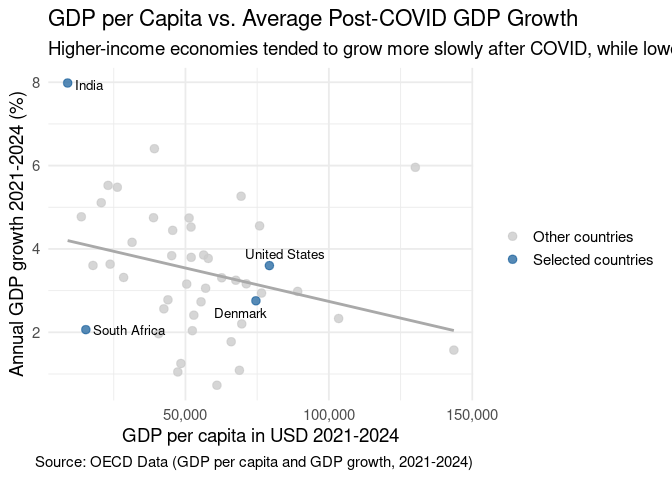

Project memo
================
AJJ

This document should contain a detailed account of the data clean up for
your data and the design choices you are making for your plots. For
instance you will want to document choices you’ve made that were
intentional for your graphic, e.g. color you’ve chosen for the plot.
Think of this document as a code script someone can follow to reproduce
the data cleaning steps and graphics in your handout.

``` r
library(tidyverse)
library(broom)
library(gganimate)
library(scales)
library(readxl)
library(dplyr)
library(ggplot2)
library(ggrepel)
library(gifski)
```

## Data Clean Up Steps for Overall Data

### Step 1: Load and Inspect Dataset

``` r
GDP_Data <- read_excel("/cloud/project/data/Annual_GDP_Growth_OECD_and_non_OECD.xlsx")
# View(Annual_GDP_Growth_OECD_and_non_OECD)

GDP_Per_Capita <- read_excel("/cloud/project/data/Annual GDP Per Capita OECD and Non-OECD.xlsx.xlsx")
# View(Annual_GDP_Per_Capita_OECD_and_Non_OECD_xlsx)
```

### Step 2: Rename Columns and Pivot Longer

``` r
names(GDP_Per_Capita)[1] <- "Country"
```

``` r
# make all column names characters  
names(GDP_Data) <-
  as.character(names(GDP_Data))

# convert all "year" columns (2018–2024) to characters before pivoting
GDP_Data <-
  GDP_Data %>%
  mutate(across(matches("^20"), as.character))

# pivot longer using the original "Time Period" column  
gdp_growth_long <- GDP_Data %>%
  pivot_longer(
    cols = matches("^20"),       # selects 2018–2024 columns
    names_to = "Year",
    values_to = "GDP_Growth"
  ) %>%
  mutate(
    Year = as.integer(Year),     # turn "2018" → 2018
     GDP_Growth = as.numeric(GDP_Growth),
    Country = `Time period`
  ) %>%
  select(-`Time period`)

gdp_growth_long <- gdp_growth_long %>%
  filter(Country != "Country")

GDP_Per_Capita <- GDP_Per_Capita %>%
  filter(str_trim(Country) != "Country") %>%
  select(-2)
```

Description: The dataset originally had years (2018–2024) as columns,
which makes it wide. pivot_longer() converts it into a tidy long format
with Year and GDP_Growth columns, making it easier to plot over time.

### Step 3: Categorize Countries by Post Pandemic Growth

``` r
post_pandemic_growth <- gdp_growth_long %>%
  filter(Year >= 2021) %>%
  group_by(`Country`) %>%
  summarize(avg_growth_post_pandemic = mean(GDP_Growth, na.rm = TRUE)) %>%
  arrange(desc(avg_growth_post_pandemic))
```

Description:

### Step 4: Clean Non-OECD Countries from Filtered Data

``` r
gdp_growth_long <- gdp_growth_long %>%
  mutate(`Country` = str_replace(`Country`, pattern = "·  ", replacement = ""))
```

## Plots

#### Final Plot 1

### Plot 1: GDP Growth Trends Over Time by Country

#### Data cleanup steps specific to plot 1

Already handled above (pivot + filter + mutate).

``` r
# Filter for your four focus countries
focus_countries <- c("United States", "Denmark", "South Africa", "India")

plot1_gdp_trends <- gdp_growth_long %>%
  filter(`Country` %in% focus_countries) %>%
  ggplot(aes(x = Year, y = GDP_Growth, color = `Country`, group = `Country`)) +
  geom_line(size = 1.2) +
  geom_point(size = 2) +
  labs(
    title = "GDP Growth Trends (2018–2024)",
    subtitle = "Tracking Pre-, During-, and Post-COVID Economic Growth",
    x = "Year",
    y = "GDP Growth (%)",
    color = "Country",
    caption = "Source: OECD Data (Annual Real GDP Growth, 2018–2024)"
  ) +
  theme_minimal(base_size = 13) +
  theme(legend.position = "bottom") + 
  scale_color_viridis_d() +
    ylim(-10, NA) +
    annotate("text", x = 2020, y = -7, label = "COVID Outbreak", color = "black", size = 4, vjust = 1.5)
```

    ## Warning: Using `size` aesthetic for lines was deprecated in ggplot2 3.4.0.
    ## ℹ Please use `linewidth` instead.
    ## This warning is displayed once every 8 hours.
    ## Call `lifecycle::last_lifecycle_warnings()` to see where this warning was
    ## generated.

``` r
ggsave("plot1_gdp_trends.png", plot = plot1_gdp_trends, width = 7, height = 5)
plot1_gdp_trends
```


#### Description:

This line plot tracks GDP growth for Denmark, India, South Africa, and
the United States from 2018 to 2024, allowing for a comparison of
economic performance before, during, and after the COVID-19 pandemic.
The plot highlights the collapse in growth for all four countries in
2020, followed by their rebound in 2021 and the more moderate variations
that follow through 2024.

The goal of this visualization is not only to measure post-COVID
recovery but also to show the broader economic trajectory each country
has taken across three phases: pre-pandemic stability, the sharp
contraction in 2020, and the uneven recovery that followed. The four
countries were chosen deliberately to represent different continents and
to contrast two OECD members (Denmark and the United States) with two
non-OECD economies (India and South Africa).

A few broader patterns stand out. India shows the most dramatic swings,
with the steepest decline during the pandemic and the strongest rebound
immediately afterward. This reflects a common pattern among fast-growing
emerging economies, which tend to expand rapidly in good years but also
contract more sharply during global shocks. In contrast, the United
States and Denmark display more moderate movements around the baseline,
characteristic of advanced economies with steadier long-term growth
dynamics. South Africa sits between these extremes, with a slower
recovery and more modest post-2021 growth.

Taken together, our plot shows how different country’s economic
structures shape their vulnerability and resilience. High-growth
emerging economies like India experience far more volatility, while more
advanced OECD economies drop and recover more gradually.

### Plot 2: Average GDP Growth by Category

``` r
post_pandemic_growth <- gdp_growth_long %>%
  filter(Year >= 2021) %>%
  group_by(`Country`) %>%
  summarize(avg_growth_post_pandemic = mean(GDP_Growth, na.rm = TRUE)) %>%
  arrange(desc(avg_growth_post_pandemic))

plot2_post_pandemic <- post_pandemic_growth %>%
  slice_max(avg_growth_post_pandemic, n = 15) %>%
  ggplot(aes(x = reorder(`Country`, avg_growth_post_pandemic), y = avg_growth_post_pandemic)) +
  geom_col(fill = "#0072B2") +
  coord_flip() +
  labs(
    title = "Top 15 Countries by GDP Growth (2021–2024)",
    subtitle = "Post-COVID Economic Recovery Strength",
    x = "Country",
    y = "GDP Growth (%)",
  ) +
  theme_minimal(base_size = 13)

ggsave("plot2_post_pandemic.png", plot = plot2_post_pandemic, width = 7, height = 5)
plot2_post_pandemic
```


#### Description:

This bar plot displays the top fifteen countries by average annual GDP
growth over the period from 2021 to 2024. The values shown represent the
mean growth rate across these four post-pandemic years. This helps
smooth out year-to-year swings and gives a clearer sense of each
country’s overall recovery strength.

India stands out clearly as the strongest performer in the dataset, with
average annual growth close to 8 percent. Türkiye, Ireland, and China
follow, each with averages near or slightly above 6 percent. The
remaining countries decline gradually down the ranking, but all still
exhibit relatively solid performance compared with the broader dataset.
Because this plot only shows the fifteen best-performing nations, even
the countries at the bottom of this list grew faster on average than
roughly thirty other countries not included in the chart.

A broader pattern is visible as well. Many of the economies near the top
of the ranking are either large emerging markets or countries that
experienced strong post-COVID rebounds driven by domestic demand,
targeted sector expansion, or favorable structural trends. Countries
further down the list are often smaller advanced economies whose growth
rates tend to be steadier and more moderate. Taken together, the plot
highlights how uneven the post-pandemic recovery has been across the
world, with some nations surging ahead while others regained momentum at
a slower pace.

### Plot 3: GDP Growth Distribution by Recovery Category (2021-2024)

``` r
# Step 1: Categorize countries based on post-pandemic average growth
gdp_growth_long_cat <- gdp_growth_long %>%
  filter(Year >= 2021) %>%
  group_by(`Country`) %>%
  mutate(
    avg_growth = mean(GDP_Growth, na.rm = TRUE),
    Recovery_Category = case_when(
      avg_growth > 0 & avg_growth <= 3 ~ "Recovering",
      avg_growth > 3 ~ "Booming",
      TRUE ~ NA_character_
    )
  ) %>%
  ungroup()

# Step 2: Remove any rows with NA in Recovery_Category
gdp_growth_long_cat <- gdp_growth_long_cat %>%
  filter(!is.na(Recovery_Category))

# Step 3: Create box plot
plot3_box <- gdp_growth_long_cat %>%
  ggplot(aes(x = Recovery_Category, y = GDP_Growth, fill = Recovery_Category)) +
  geom_boxplot(alpha = 0.8, outlier.color = "gray30") +
  labs(
    title = "GDP Growth Distribution by Recovery Category (2021–2024)",
    subtitle = "Excluding countries with missing or incomplete GDP growth data",
    x = "Recovery Category",
    y = "GDP Growth (%)",
    ) +
  scale_fill_manual(values = c(
    "Recovering" = "#F1C40F",
    "Booming" = "#2ECC71"
  )) +
  theme_minimal(base_size = 13) +
  theme(legend.position = "none") +
  scale_fill_viridis_d()

# Step 4: Save and display plot
ggsave("plot3_box.png", plot = plot3_box, width = 5, height = 4)
plot3_box
```


#### Description:

The boxplot compares GDP growth distributions for the two recovery
categories, Booming and Recovering, over the period from 2021 to 2024.
Most countries in the dataset fall into the Booming category, which
shows that a large share of both OECD and non-OECD economies experienced
average annual growth above 3 percent during the post-COVID recovery.
The Recovering category has fewer countries and shows a noticeably lower
median rate of growth.

Initially, we wanted to add a category named “stagnating” but we decided
against doing so, as no single country in our datasets had average
growth in negative levels during the selected time period, which would
have classified them as stagnating.

The Booming group has a wider range of values and includes one clear
outlier at the top, which represents Ireland’s unusually high
post-pandemic growth. The Recovering group is more tightly clustered,
with values concentrated closer to zero.

A broader pattern also emerges from the distribution. Many advanced
economies, such as Germany, Austria, Finland, and the Netherlands, show
slower growth and therefore appear more often in the Recovering
category. This reflects typical features of mature, high-income
economies, which tend to expand at a steadier and slower pace. In
contrast, several emerging and developing economies in Asia and Africa
experienced rapid post-COVID rebounds driven by rising domestic demand,
expanding labor markets, and catch-up growth. These types of countries
tend to be in the Booming category.

### Plot 4: GDP Growth Animation

``` r
# Highlight countries
focus_countries <- c("United States", "Denmark", "India", "South Africa")
gdp_region <- gdp_region %>%
  mutate(Highlight = ifelse(Country %in% focus_countries, "Focus", "Other"))

focus_colors <- c(
  "United States" = "#0072B2",
  "Denmark"       = "#009E73",
  "India"         = "#D55E00",
  "South Africa"  = "#CC79A7"
)

# Plot with COVID shading and labels that stick to one side
plot_region_covid <- gdp_region %>%
  ggplot(aes(x = Year, y = GDP_Growth, group = Country)) +

  # COVID shading
  annotate("rect",
           xmin = 2019.5, xmax = 2020.5,
           ymin = -Inf, ymax = Inf,
           fill = "red", alpha = 0.1) +

  # Other countries
  geom_line(
    data = gdp_region %>% filter(Highlight == "Other"),
    aes(color = Region),
    alpha = 0.3,
    linewidth = 0.7
  ) +

  # Highlighted countries
  geom_line(
    data = gdp_region %>% filter(Highlight == "Focus"),
    aes(color = Country),
    linewidth = 2
  ) +

  geom_point(
    data = gdp_region %>% filter(Highlight == "Focus"),
    aes(color = Country),
    size = 2.5
  ) +

  # Labels that follow the lines but stick to the right side
  geom_text_repel(
    data = gdp_region %>% filter(Highlight == "Focus"),
    aes(label = Country, color = Country),
    nudge_x = 0.2,        # shift all labels to the right
    direction = "y",       # only allow movement vertically
    hjust = 0,             # left-align text
    segment.color = NA,    # remove connector lines
    size = 5,
    show.legend = FALSE,
    force = 0.1            # reduces jitter so labels don't jump
  ) +

  scale_color_manual(
    values = c(
      "North America"="darkgreen",
      "Europe"="darkblue",
      "Africa"="orange",
      "Southeast Asia"="purple",
      "Other"="grey70",
      focus_colors
    )
  ) +

  labs(
    title = "GDP Growth by Region (2018–2024)",
    subtitle = "COVID-19 recession in 2020 is highlighted",
    x = "Year",
    y = "GDP Growth (%)",
    color = "Region / Highlighted Countries"
  ) +
  theme_minimal(base_size = 16) +
  theme(legend.position = "bottom") +
  transition_reveal(Year)

# Animate
animate(
  plot_region_covid,
  fps = 9,
  duration = 10,
  width = 750,
  height = 500,
  renderer = gifski_renderer()
)
```

Description:

The animated line plot illustrates how GDP growth evolved across world
regions from 2018 to 2024, with a particular emphasis on the impact of
the COVID-19 recession in 2020 and the recovery that followed. Each
country in the dataset is shown as a faint grey line, allowing the
broader regional distribution to remain visible in the background. Four
countries: India, the United States, Denmark, and South Africa, are
highlighted in distinct colors so their trajectories can be compared
more easily.

As the animation progresses year by year, the viewer can follow how
growth levels change over time. All countries move sharply downward in
2020, which is marked by a red-shaded band to visually identify the
COVID downturn. After this low point, most economies rebound in 2021,
but the extent of the recovery differs substantially. India stands out
as the strongest performer, climbing dramatically above the others in
the immediate post-Covid period. The remaining highlighted countries
recover more moderately, with South Africa and Denmark following slower,
flatter paths, and the United States sitting roughly between them.

The outlier at the top of the plot, showing GDP growth above 16% in
2021, is Ireland. This unusually high figure reflects several structural
factors in the way Ireland’s GDP is measured. Because many multinational
corporations register their intellectual property and profits in
Ireland, their global earnings are counted in Ireland’s national
accounts even when most of the underlying economic activity takes place
elsewhere. This accounting effect inflates headline GDP growth, making
Ireland appear to grow far faster than the underlying domestic economy.
As the de facto EU hub for many large global firms, Ireland’s GDP
metrics are therefore highly sensitive to multinational profit flows
rather than traditional economic output alone, which also is high at
around 5% annually.

Additionally, the noticeable uptick in Denmark’s 2024 growth reflects
the extraordinary performance of its pharmaceutical sector, driven in
particular by Novo Nordisk. Recent estimates indicate that the company
alone contributed roughly half of Denmark’s total GDP growth during the
last 2 years, amplifying the country’s post-pandemic recovery figures.

The animation helps reveal not just the magnitude of growth changes, but
also the timing and steepness of each country’s trajectory. This dynamic
presentation makes it easier to see how the shock of 2020 unfolded and
how different economies diverged in the years that followed.

### Plot 5: GDP per Capita vs. Average Post-COVID GDP Growth

``` r
# 1. Clean and average GDP per capita, 2021-2024

gdp_pc_avg <- GDP_Per_Capita |>
  mutate(Country = trimws(Country)) |>
  # make sure year columns are numeric
  mutate(across(`2021`:`2024`, as.numeric)) |>
  select(Country, `2021`:`2024`) |>
  pivot_longer(
    cols      = `2021`:`2024`,
    names_to  = "Year",
    values_to = "gdp_pc"
  ) |>
  group_by(Country) |>
  summarise(
    avg_gdp_pc = mean(gdp_pc, na.rm = TRUE),
    .groups = "drop"
  )
```

    ## Warning: There were 4 warnings in `mutate()`.
    ## The first warning was:
    ## ℹ In argument: `across(`2021`:`2024`, as.numeric)`.
    ## Caused by warning:
    ## ! NAs introduced by coercion
    ## ℹ Run `dplyr::last_dplyr_warnings()` to see the 3 remaining warnings.

``` r
# 2. Average GDP growth per country

gdp_growth_avg <- gdp_growth_long_cat |>
  mutate(Country = trimws(Country)) |>
  select(Country, avg_growth) |>
  distinct()

# 3. Join growth + income

growth_vs_income <- gdp_growth_avg |>
  inner_join(gdp_pc_avg, by = "Country") |>
  filter(!is.na(avg_gdp_pc), !is.na(avg_growth))

# 4. Highlight 4 focus countries

focus_countries <- c("India", "United States", "Denmark", "South Africa")

growth_vs_income <- growth_vs_income |>
  mutate(
    Highlight = if_else(
      Country %in% focus_countries,
      "Selected countries",
      "Other countries"
    )
  )

# 5. Scatterplot

growth_income_plot <- growth_vs_income |>
  ggplot(aes(x = avg_gdp_pc, y = avg_growth, color = Highlight)) +
  geom_point(size = 2.5, alpha = 0.8) +
  geom_smooth(method = "lm", se = FALSE, color = "darkgrey", linewidth = 1) +
  geom_text_repel(
    data = subset(growth_vs_income, Country %in% focus_countries),
    aes(label = Country),
    size = 3.5,
    color = "black",
    box.padding = 0.3,
    max.overlaps = 20,
    show.legend = FALSE
  ) +
  scale_color_manual(values = c(
  "Selected countries" = "#2C6DA4",
  "Other countries" = "grey80"
    )
  ) +
  scale_x_continuous(labels = scales::comma) +
  labs(
    title    = "GDP per Capita vs. Average Post-COVID GDP Growth",
    subtitle = "Higher-income economies tended to grow more slowly after COVID, while lower-income countries grew faster.",
    x        = "GDP per capita in USD 2021-2024",
    y        = "Annual GDP growth 2021-2024 (%)",
    color    = "",
    caption = "Source: OECD Data (GDP per capita and GDP growth, 2021-2024)"
  ) +
  theme_minimal(base_size = 14)

print(growth_income_plot)
```

<!-- -->
