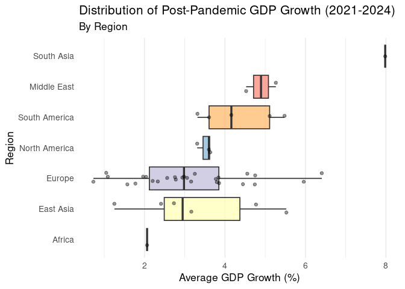

Project proposal
================
AJJ: Armin, Jiwon, Jamari

``` r
library(tidyverse)
library(broom)
library(readxl)
library(dplyr)
library(ggplot2)
library(ggrepel)
library(gganimate)  
library(scales)  
library(geomtextpath) # Provides geom_textpath
library(countrycode)
```

``` r
# install.packages("gifski")
# install.packages("png")
# install.packages(c("ggplot2", "gganimate", "geomtextpath", "dplyr"))
```

## 1. Introduction

The data for our group project is sourced from the OECD, specifically
from two sources: “Annual Real GDP Growth - OECD and Non-OECD Countries”
and “Annual GDP and Consumption Per Capita - OECD and Non-OECD
Countries.”

The first dataset provides annual GDP growth figures for OECD member
states and selected non-member countries covering the years 2018-2024,
while the second dataset reports GDP and consumption per capita over the
same period. Together, these datasets allow us to analyze how different
nations recovered economically following the severe disruptions of the
COVID-19 pandemic. The selected time frame enables us to trace economic
trajectories before, during, and after the pandemic, helping us
understand both the immediate impact and the long-term recovery
patterns.

After data cleaning, our datasets contained fewer than 750 combined data
points, with 46 observations and 8 variables in each initial dataset,
before further changes were made down the line. We excluded large
economic blocs such as the EU or G7 to focus exclusively on
national-level performance and to avoid potential data overlap. For our
analysis, we will focus primarily on four countries: the United States,
Denmark, South Africa, and India. Two of these nations are OECD members,
while the other two are not. This is a deliberate choice to highlight
contrasts between advanced and emerging economies.

Moreover, we plan to add a few additional variables to our dataset by
categorizing the levels of economic recovery into performance groups.
These categories may include classifications such as recovering and
booming. This transformation will allow us to better visualize and
compare how selected countries performed during the post-Covid recovery
period, providing clearer insights into the relative strength and pace
of their economic rebounds.

For this project, our research focuses on the varying levels of economic
recovery around the world following the COVID-19 pandemic. We aim to
closely examine the observations in our datasets to identify potential
patterns (such as geographic or regional trends) that reveal which
countries recovered quickly and which continued to face significant
challenges.

Some of the questions we hope to explore include:

- Are there identifiable geographic patterns indicating which countries
  were more effective in rebounding economically?

- How much did the average year-on-year GDP growth rates vary across
  countries and regions, and were there any notable outliers?

- What factors might explain why some countries recovered more
  successfully than others? We plan to compare and analyze selected
  countries.

- How can we meaningfully categorize countries into groups such as
  recovering and booming, and what does the global distribution of these
  categories reveal about overall recovery trends?

- Among our four selected economies, which performed best, and what key
  drivers contributed to their relative success?

## 2. Data

``` r
GDP_Data <- read_excel("/cloud/project/data/Annual_GDP_Growth_OECD_and_non_OECD.xlsx")
# View(GDP_Data)

GDP_Per_Capita <- read_excel("/cloud/project/data/Annual GDP Per Capita OECD and Non-OECD.xlsx.xlsx")
# View(GDP_Per_Capita)
```

``` r
dim(GDP_Data)
```

    ## [1] 47  8

``` r
dim(GDP_Per_Capita)
```

    ## [1] 47  9

``` r
glimpse(GDP_Data)
```

    ## Rows: 47
    ## Columns: 8
    ## $ `Time period` <chr> "Country", "Australia", "Austria", "Belgium", "Canada", …
    ## $ `2018`        <dbl> NA, 2.8349175, 2.4842210, 1.8779685, 2.7429634, 3.990029…
    ## $ `2019`        <dbl> NA, 1.9154753, 1.7549763, 2.4428900, 1.9084319, 0.634367…
    ## $ `2020`        <dbl> NA, -2.01405865, -6.31825516, -4.79296338, -5.03823342, …
    ## $ `2021`        <chr> NA, "5.4441441719999997", "4.923091748", "6.254433953000…
    ## $ `2022`        <chr> NA, "4.1186485880000001", "5.3309725969999997", "3.95625…
    ## $ `2023`        <chr> NA, "2.0248715439999998", "-0.78624417999999996", "1.714…
    ## $ `2024`        <chr> NA, "1.0669975759999999", "-0.65908973800000004", "1.070…

``` r
glimpse(GDP_Per_Capita)
```

    ## Rows: 47
    ## Columns: 9
    ## $ `Time period` <chr> "Country", "Australia", "Austria", "Belgium", "Canada", …
    ## $ ...2          <chr> "Combined unit of measure", "US dollars per person, PPP …
    ## $ `2018`        <dbl> NA, 53051.72, 56654.55, 52466.55, 49982.65, 25496.43, 15…
    ## $ `2019`        <dbl> NA, 53602.04, 60370.46, 56712.36, 50498.96, 25733.10, 16…
    ## $ `2020`        <dbl> NA, 56821.62, 58522.84, 56119.62, 48590.72, 25236.62, 15…
    ## $ `2021`        <chr> NA, "65002.659138000003", "62998.849713000003", "60668.6…
    ## $ `2022`        <chr> NA, "72576.307081000006", "70865.595503999997", "68157.8…
    ## $ `2023`        <chr> NA, "73401.167048000003", "71173.472523999997", "69102.7…
    ## $ `2024`        <chr> NA, "73888.300352999999", "73427.587778000001", "72289.3…

``` r
names(GDP_Data)
```

    ## [1] "Time period" "2018"        "2019"        "2020"        "2021"       
    ## [6] "2022"        "2023"        "2024"

``` r
names(GDP_Per_Capita)
```

    ## [1] "Time period" "...2"        "2018"        "2019"        "2020"       
    ## [6] "2021"        "2022"        "2023"        "2024"

## 3. Data analysis plan

The variables we will be visualizing to explore our research question
are the following:

- GDP_growth: Core measure of economic recovery; allows comparison
  across countries and time.
- GDP_Per_Capita: Core measure of economic recovery per person within a
  geographich region; allows comparison across countries and time.
- Timeline: Time-series analysis to see trends over time between 2018 to
  2024.
- Country: Compare recovery across nations and regions.
- Recovery_category: Helps visualize and compare group-level
  performance; categorized as “Recovering” and “Booming”.
- Continent/region: Explore geographic patterns in recovery

Other additional data we may explore are datasets which will categorize
the levels of economic recovery from COVID-19 into performance groups.
These categories may include classifications such as recovering and
booming. This transformation will allow us to better visualize and
compare how different countries performed during the post-Covid recovery
period, providing clearer insights into the relative strength and pace
of their economic rebounds.

Our goal for the project is to examine the differences in economic
recovery across OECD countries from the COVID-19 pandemic. We will
observe using GDP growth data ranging from 2018 to 2024, as well as
measuring GDP Per Capita data during the same time period. Our view
comes from different statistics which categorize countries that
experienced the fastest and most sustained economic recoveries.

We’ll start with exploratory data analysis to help us understand trends
and the structure of our dataset. We’ll summarize tendencies, and other
important information the dataset provides. Once we understand the
dataset, then we’ll begin to visualize and explore the recovery patterns
within the time period, while distinguishing geography, and economics.

- GDP_growth: GDP growth is the variable representing the annual
  percentage change. It is the main measure of economic recovery, and
  allows us to compare within countries and time periods.

- GDP_Per_Capita: GDP Per Capita is the variable representing the annual
  GDP percentage change per individual in a geographic region. It is one
  of the main measures of economic recovery, and allows us to compare
  within countries and time periods. It provides a similar, yet slightly
  different metric to just GDP growth by additionally exploring how
  citizens’ wealth grew over the selected time period.

- Timeline: The dataset starts in 2018 to 2024, which gives us
  information on GDP before, during, and after the pandemic. Looking at
  the times before and present day will directly provide us with the
  recovery time and sustainability.

- Country: We’ll use this variable to compare the economic recoveries
  across nations. Differences can range due to policies or resource
  factors that may limit a nation’s growth or have it thrive.

- Recovery_category: We’ll classify countries as Recovering or Booming
  based on their post pandemic GDP growth averages. This will allow us
  to visualise and for our group to make an analysis.

- Continent/Region: From this we’ll be able to identify patterns from
  different regions, and how different regions were affected and able to
  recover faster/slower.

Exploratory Data Analysis:

We’ll start by cleaning the dataset by removing unnecessary information
and converting the dataset to quarterly time. Then we’ll identify
countries with the highest/lowest GDP growth past the pandemic. We can
do this by using histograms and boxplots to identify outliers in the
dataset. Lastly, we’ll summarize the dataset. We’ll show who had the
strongest recovery post pandemic, and how consistent the patterns were
within each region:

``` r
names(GDP_Per_Capita)[1] <- "Country"
```

``` r
# make all column names characters  
names(GDP_Data) <-
  as.character(names(GDP_Data))

# convert all "year" columns (2018–2024) to characters before pivoting
GDP_Data <-
  GDP_Data %>%
  mutate(across(matches("^20"), as.character))

# pivot longer using the original "Time Period" column  
gdp_growth_long <- GDP_Data %>%
  pivot_longer(
    cols = matches("^20"),       # selects 2018–2024 columns
    names_to = "Year",
    values_to = "GDP_Growth"
  ) %>%
  mutate(
    Year = as.integer(Year),     # turn "2018" → 2018
     GDP_Growth = as.numeric(GDP_Growth),
    Country = `Time period`
  ) %>%
  select(-`Time period`)

gdp_growth_long <- gdp_growth_long %>%
  filter(Country != "Country")

GDP_Per_Capita <- GDP_Per_Capita %>%
  filter(str_trim(Country) != "Country") %>%
  select(-2)

glimpse(gdp_growth_long)
```

    ## Rows: 322
    ## Columns: 3
    ## $ Year       <int> 2018, 2019, 2020, 2021, 2022, 2023, 2024, 2018, 2019, 2020,…
    ## $ GDP_Growth <dbl> 2.8349175, 1.9154753, -2.0140586, 5.4441442, 4.1186486, 2.0…
    ## $ Country    <chr> "Australia", "Australia", "Australia", "Australia", "Austra…

``` r
summary_stats <- gdp_growth_long %>%
  group_by(Year) %>%
  summarize(
    mean_growth = mean(GDP_Growth, na.rm = TRUE),
    median_growth = median(GDP_Growth, na.rm = TRUE),
    sd_growth = sd(GDP_Growth, na.rm = TRUE),
    min_growth = min(GDP_Growth, na.rm = TRUE),
    max_growth = max(GDP_Growth, na.rm = TRUE),
    .groups = "drop"
  )

print(summary_stats)
```

    ## # A tibble: 7 × 6
    ##    Year mean_growth median_growth sd_growth min_growth max_growth
    ##   <int>       <dbl>         <dbl>     <dbl>      <dbl>      <dbl>
    ## 1  2018        3.02         2.82       1.90      -2.62       7.69
    ## 2  2019        2.26         2.15       1.63      -2.00       6.1 
    ## 3  2020       -3.94        -3.84       3.50     -10.9        7.15
    ## 4  2021        6.87         6.39       2.59       2.68      16.3 
    ## 5  2022        3.92         3.71       2.58      -1.23      12.0 
    ## 6  2023        1.43         0.976      2.29      -2.74       8.83
    ## 7  2024        1.67         1.39       1.69      -1.34       6.72

``` r
post_pandemic_growth <- gdp_growth_long %>%
  filter(Year >= 2021) %>%
  group_by(`Country`) %>%
  summarize(avg_growth_post_pandemic = mean(GDP_Growth, na.rm = TRUE)) %>%
  arrange(desc(avg_growth_post_pandemic))
```

``` r
gdp_growth_long <- gdp_growth_long %>%
  mutate(`Country` = str_replace(`Country`, pattern = "·  ", replacement = ""))
```

Planned Data Visualization: - Line Plots: to represent the time
periods - Box Plots: to separate data between regions - Bar Charts: to
compare the average GDP growth by each country - Scatter Plot: to
represent the recovery time vs. GDP growth

# Plot1: GDP Growth Trends Over Time by Country

``` r
# Filter for your four focus countries
focus_countries <- c("United States", "Denmark", "South Africa", "India")

plot1_gdp_trends <- gdp_growth_long %>%
  filter(`Country` %in% focus_countries) %>%
  ggplot(aes(x = Year, y = GDP_Growth, color = `Country`, group = `Country`)) +
  geom_line(size = 1.2) +
  
  geom_point(size = 2) +
  
  labs(
    title = "GDP Growth Trends (2018–2024)",
    subtitle = "Tracking Pre-, During-, and Post-COVID Economic Growth",
    x = "Year",
    y = "GDP Growth (%)",
    color = "Country",
    caption = "Source: OECD Data (Annual Real GDP Growth, 2018–2024)"
  ) +
  
  theme_minimal(base_size = 13) +
  
  theme(legend.position = "bottom") + 
  
  scale_color_viridis_d() +
  
    ylim(-10, NA) +
  
    annotate("text", x = 2020, y = -7, label = "COVID Outbreak", color = "black", size = 4, vjust = 1.5)
```

    ## Warning: Using `size` aesthetic for lines was deprecated in ggplot2 3.4.0.
    ## ℹ Please use `linewidth` instead.
    ## This warning is displayed once every 8 hours.
    ## Call `lifecycle::last_lifecycle_warnings()` to see where this warning was
    ## generated.

``` r
ggsave("plot1_gdp_trends.png", plot = plot1_gdp_trends, width = 7, height = 5)

plot1_gdp_trends
```


# Plot 2: Average GDP Growth by Category

``` r
post_pandemic_growth <- gdp_growth_long %>%
  filter(Year >= 2021) %>%
  group_by(`Country`) %>%
  summarize(avg_growth_post_pandemic = mean(GDP_Growth, na.rm = TRUE)) %>%
  arrange(desc(avg_growth_post_pandemic))

plot2_post_pandemic <- post_pandemic_growth %>%
  slice_max(avg_growth_post_pandemic, n = 15) %>%
  ggplot(aes(x = reorder(`Country`, avg_growth_post_pandemic), y = avg_growth_post_pandemic)) +
  
  geom_col(fill = "#0072B2") +
  
  coord_flip() +
  
  labs(
    title = "Top 15 Countries by GDP Growth (2021–2024)",
    subtitle = "Post-COVID Economic Recovery Strength",
    x = "Country",
    y = "GDP Growth (%)",
  ) +
  
  theme_minimal(base_size = 13)

ggsave("plot2_post_pandemic.png", plot = plot2_post_pandemic, width = 7, height = 5)

plot2_post_pandemic
```


\# Plot 3: GDP Growth Distribution by Recovery Category (2021-2024)

``` r
# Step 1: Categorize countries based on post-pandemic average growth

gdp_growth_long_cat <- gdp_growth_long %>%
  filter(Year >= 2021) %>%
  group_by(`Country`) %>%
  mutate(
    avg_growth = mean(GDP_Growth, na.rm = TRUE),
    Recovery_Category = case_when(
      avg_growth > 0 & avg_growth <= 3 ~ "Recovering",
      avg_growth > 3 ~ "Booming",
      TRUE ~ NA_character_
    )
  ) %>%
  ungroup()

# Step 2: Remove any rows with NA in Recovery_Category
gdp_growth_long_cat <- gdp_growth_long_cat %>%
  filter(!is.na(Recovery_Category))

# Step 3: Create box plot
plot3_box <- gdp_growth_long_cat %>%
  ggplot(aes(x = Recovery_Category, y = GDP_Growth, fill = Recovery_Category)) +
  geom_boxplot(alpha = 0.8, outlier.color = "gray30") +
  labs(
    title = "GDP Growth Distribution by Recovery Category (2021–2024)",
    subtitle = "Excluding countries with missing or incomplete GDP growth data",
    x = "Recovery Category",
    y = "GDP Growth (%)",
    ) +
  scale_fill_manual(values = c(
    "Recovering" = "#F1C40F",
    "Booming" = "#2ECC71"
  )) +
  theme_minimal(base_size = 13) +
  
  theme(legend.position = "none") +
  
  scale_fill_viridis_d()

# Step 4: Save and display plot
ggsave("plot3_box.png", plot = plot3_box, width = 5, height = 4)

plot3_box
```


\# Plot 4: GDP Growth Animation

``` r
# Highlight countries
focus_countries <- c("United States", "Denmark", "India", "South Africa")
gdp_region <- gdp_region %>%
  mutate(Highlight = ifelse(Country %in% focus_countries, "Focus", "Other"))

focus_colors <- c(
  "United States" = "#0072B2",
  "Denmark"       = "#009E73",
  "India"         = "#D55E00",
  "South Africa"  = "#CC79A7"
)

# Plot with COVID shading and labels that stick to one side
plot_region_covid <- gdp_region %>%
  ggplot(aes(x = Year, y = GDP_Growth, group = Country)) +

  # COVID shading
  annotate("rect",
           xmin = 2019.5, xmax = 2020.5,
           ymin = -Inf, ymax = Inf,
           fill = "red", alpha = 0.1) +

  # Other countries
  geom_line(
    data = gdp_region %>% filter(Highlight == "Other"),
    aes(color = Region),
    alpha = 0.3,
    linewidth = 0.7
  ) +

  # Highlighted countries
  geom_line(
    data = gdp_region %>% filter(Highlight == "Focus"),
    aes(color = Country),
    linewidth = 2
  ) +

  geom_point(
    data = gdp_region %>% filter(Highlight == "Focus"),
    aes(color = Country),
    size = 2.5
  ) +

  # Labels that follow the lines but stick to the right side
  geom_text_repel(
    data = gdp_region %>% filter(Highlight == "Focus"),
    aes(label = Country, color = Country),
    nudge_x = 0.2,        # shift all labels to the right
    direction = "y",       # only allow movement vertically
    hjust = 0,             # left-align text
    segment.color = NA,    # remove connector lines
    size = 5,
    show.legend = FALSE,
    force = 0.1            # reduces jitter so labels don't jump
  ) +

  scale_color_manual(
    values = c(
      "North America"="darkgreen",
      "Europe"="darkblue",
      "Africa"="orange",
      "Southeast Asia"="purple",
      "Other"="grey70",
      focus_colors
    )
  ) +

  labs(
    title = "GDP Growth by Region (2018–2024)",
    subtitle = "COVID-19 recession in 2020 is highlighted",
    x = "Year",
    y = "GDP Growth (%)",
    color = "Region / Highlighted Countries"
  ) +
  
  theme_minimal(base_size = 16) +
  theme(legend.position = "bottom") +
  
  transition_reveal(Year)

# Animate
animate(
  plot_region_covid,
  fps = 9,
  duration = 10,
  width = 750,
  height = 500,
  renderer = gifski_renderer()
)
```

# Plot 5: GDP per Capita vs. Average Post-COVID GDP Growth

``` r
# Clean and average GDP per capita, 2021-2024

gdp_pc_avg <- GDP_Per_Capita |>
  mutate(Country = trimws(Country)) |>
  mutate(across(`2021`:`2024`, as.numeric)) |>
  select(Country, `2021`:`2024`) |>
  pivot_longer(
    cols      = `2021`:`2024`,
    names_to  = "Year",
    values_to = "gdp_pc"
  ) |>
  group_by(Country) |>
  summarise(
    avg_gdp_pc = mean(gdp_pc, na.rm = TRUE),
    .groups = "drop"
  )
```

    ## Warning: There were 4 warnings in `mutate()`.
    ## The first warning was:
    ## ℹ In argument: `across(`2021`:`2024`, as.numeric)`.
    ## Caused by warning:
    ## ! NAs introduced by coercion
    ## ℹ Run `dplyr::last_dplyr_warnings()` to see the 3 remaining warnings.

``` r
# Average GDP growth per country

gdp_growth_avg <- gdp_growth_long_cat |>
  mutate(Country = trimws(Country)) |>
  select(Country, avg_growth) |>
  distinct()

# Join growth + income

growth_vs_income <- gdp_growth_avg |>
  inner_join(gdp_pc_avg, by = "Country") |>
  filter(!is.na(avg_gdp_pc), !is.na(avg_growth))

# OECD Membership and focus countries

oecd_countries <- c(
  "Australia","Austria","Belgium","Canada","Chile","Colombia","Costa Rica",
  "Czechia","Denmark","Estonia","Finland","France","Germany","Greece",
  "Hungary","Iceland","Ireland","Israel","Italy","Japan","Korea",
  "Latvia","Lithuania","Luxembourg","Mexico","Netherlands","New Zealand",
  "Norway","Poland","Portugal","Slovak Republic","Slovenia","Spain",
  "Sweden","Switzerland","Türkiye","United Kingdom","United States"
)

focus_countries <- c("India", "United States", "Denmark", "South Africa")

growth_vs_income <- growth_vs_income |>
  mutate(
    OECD  = if_else(Country %in% oecd_countries,
                    "OECD member", "Non-OECD"),
    Focus = Country %in% focus_countries
  )

# Scatterplot

growth_income_plot <- ggplot(growth_vs_income,
                             aes(x = avg_gdp_pc, y = avg_growth)) +
  geom_smooth(method = "lm", se = FALSE, color = "darkgrey", linewidth = 0.7) +
  geom_point(aes(color = OECD), size = 2.5, alpha = 0.8) +
  geom_point(
    data = subset(growth_vs_income, Focus),
    aes(color = OECD),
    size = 3.2
  ) +

 # labels and pointers for focus countries
  geom_text_repel(
    data = subset(growth_vs_income, Focus & Country %in% c("India", "United States", "Denmark", "South Africa")),
    aes(label = Country),
    size = 3.5,
    color = "black",
    box.padding = 0.3,
    max.overlaps = 20,
    show.legend = FALSE
  ) +
  
  geom_segment(
  data = subset(growth_vs_income, Country == "United States"),
  aes(x = avg_gdp_pc, y = avg_growth,
      xend = avg_gdp_pc + 4000, yend = avg_growth + 0.12),
  linewidth = 0.3, color = "black"
) +
  
  geom_segment(
  data = subset(growth_vs_income, Country == "Denmark"),
  aes(x = avg_gdp_pc, y = avg_growth,
      xend = avg_gdp_pc + 4000, yend = avg_growth - 0.12),
  linewidth = 0.3, color = "black"
) +
  
  geom_segment(
  data = subset(growth_vs_income, Country == "India"),
  aes(x = avg_gdp_pc, y = avg_growth,
      xend = avg_gdp_pc + 4000, yend = avg_growth + 0.12),
  linewidth = 0.3, color = "black"
) +
  
  geom_segment(
  data = subset(growth_vs_income, Country == "South Africa"),
  aes(x = avg_gdp_pc, y = avg_growth,
      xend = avg_gdp_pc + 4000, yend = avg_growth - 0.12),
  linewidth = 0.3, color = "black"
) +

  # quadrant annotations
  annotate(
    "text",
    x = 25000, y = 7.8,
    label = "Lower-income,\nfaster growth",
    hjust = 0, vjust = 1,
    size = 3.5,
    color = "black"
  ) +
  
  annotate(
    "text",
    x = 140000, y = 2.6,
    label = "Higher-income,\nslower growth",
    hjust = 1, vjust = 0,
    size = 3.5,
    color = "black"
  ) +

  scale_color_manual(
    values = c(
      "OECD member" = "#E69F00",   # orange
      "Non-OECD"    = "#1F78B4"    # blue
    )
  ) +
  
  scale_x_continuous(labels = comma) +

  labs(
    title    = "GDP per Capita vs. Average GDP Growth 2021-2024",
    subtitle = "Higher-income (mostly OECD) economies grew more slowly after Covid,\nwhile lower-income countries grew faster.",
    x        = "GDP per capita in USD",
    y        = "Annual GDP growth 2021-2024 (%)",
    color    = "OECD status",
    caption  = "Source: OECD Data (GDP per capita and GDP growth, 2021-2024)"
  ) +
  theme_minimal(base_size = 14) +
  theme(
    panel.grid.major = element_line(color = "grey85"),
    panel.grid.minor = element_blank(),
    legend.position  = "right"
  )

growth_income_plot
```


\#Plot 6: Distribution of Post-Pandemic GDP Growth by Region

``` r
# Separate it into regions
df_region <- gdp_growth_avg %>%
  
  # Clean country names
  
  mutate(Country = str_remove_all(Country, "[·\\u2007]")) %>%
  mutate(Country = str_trim(Country)) %>%
  
  # Create Region column
  
  mutate(Region = countrycode(Country, origin = "country.name", destination = "region")) %>%
  
  # Manual adjustments for specific World Bank groupings
  
  mutate(Region = case_when(
    Country %in% c("United States", "Canada", "Mexico") ~ "North America",
    Country %in% c("China (People’s Republic of)", "Japan", "Korea", "Australia", "New Zealand", "Indonesia") ~ "East Asia",
    Country == "India" ~ "South Asia",
    Country %in% c("Israel", "Saudi Arabia") ~ "Middle East",
    Country == "South Africa" ~ "Africa",
    Country %in% c("Austria", "Belgium", "Czechia", "Denmark", "Estonia", "Finland", "France", "Germany", "Greece", "Hungary", "Iceland", "Ireland", "Italy", "Latvia", "Lithuania", "Luxembourg", "Netherlands", "Norway", "Poland", "Portugal", "Slovak Republic", "Slovenia", "Spain", "Sweden", "Switzerland", "Türkiye", "United Kingdom") ~ "Europe",
    Country %in% c("Chile", "Colombia", "Costa Rica", "Argentina", "Brazil") ~ "South America",
    TRUE ~ Region
  )) %>%
  
  # This line removes the N/A from the plot
  filter(!is.na(Region)) %>%
  filter(!is.na(avg_growth))

# Creating the boxplot

plot6_region_boxplot <- df_region %>%
  ggplot(aes(x = reorder(Region, avg_growth, FUN = median), y = avg_growth, fill = Region)) +
  geom_boxplot(alpha = 0.7, outlier.shape = 16, outlier.size = 2) +
  geom_jitter(height = 0, width = 0.2, alpha = 0.4, size = 1.5) +
  coord_flip() +
  
  labs(
    title = "Distribution of Post-Pandemic GDP Growth (2021-2024)",
    subtitle = "By Region",
    x = "Region", 
    y = "Average GDP Growth (%)"
  ) +
  
  theme_minimal(base_size = 13) +
  theme(
    legend.position = "none",
    panel.grid.major.y = element_blank()
  ) +
  
  scale_fill_brewer(palette = "Set3")

ggsave("plot6_region_boxplot.png", plot = plot6_region_boxplot, width = 8, height = 5)

plot6_region_boxplot
```


